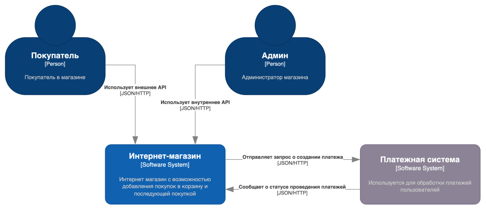
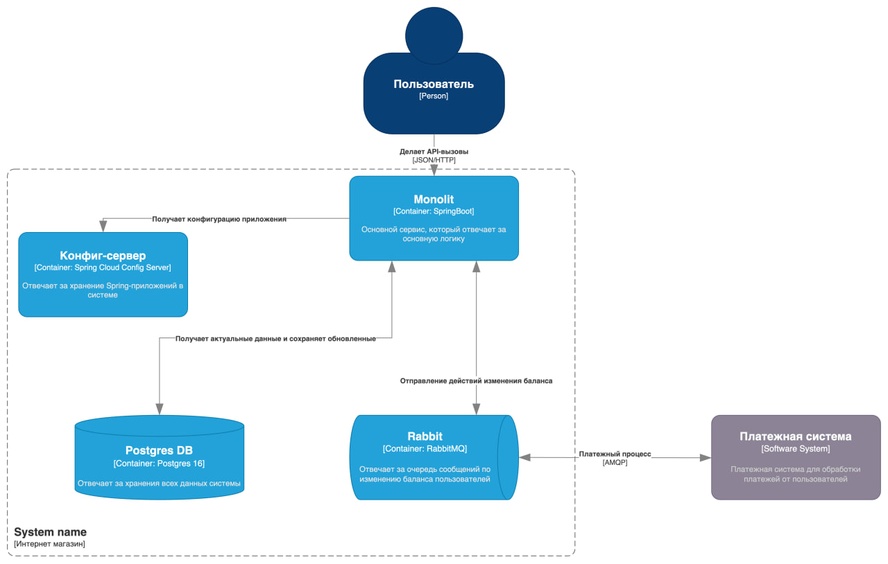

Проект представляет собой базовую реализацию веб приложения интернет магазина (e-commerce). 
В качестве основы для него мы выбрали стандарт современной веб-разработки - фреймворк Spring. Для удобства мы воспользовались Spring boot'ом, содержащим базовые настройки классов-конфигураций. Более того, мы использовали Spring boot Cloud для внедрения таких важных инфраструктурных элементов, как, например, Config Server. Для удобства дальнейшей разработки и возможности паралелльной работы над разными компонентами нашего приложения (например, back-end'ом и front-end'ом) мы сгенерировали openapi с помощью специальных декларативных программных пакетов. В качестве среды развертывание мы выбрали Docker. Мы настроили docker compose файл, так, чтобы это было единой точкой запуска нашего приложения. Также нами были написаны тестовые сценарии для Postman.

Функционал нашего приложения довольно стандартный. У нас есть три типа пользователей: неавторизованный пользователь, зарегистрированный и администратор. Пользователь без авторизации может просматривать список товаров в наличии, сортировать их по разным параметрам, группировать по категориям. Зарегистрированный пользователь может добавлять товары в корзину, пополнять баланс, оплачивать с него покупки. Администратор имеет доступ к управлению ассортиментом товаров: он может добавлять и удалять товары. 

Авторизация довольно стандартная – после ввода логина и пароля пользователь получает web-token, который используется для дальнейших запросов. По истечении “срока годности” его будет необходимо обновить, проведя повторную авторизацию. Это так же является стандартом безопасности в современных веб-системах.

